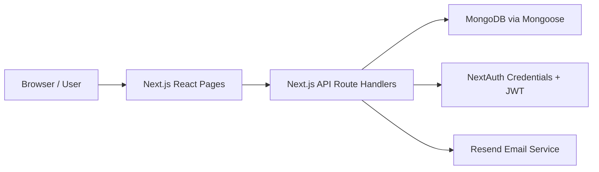
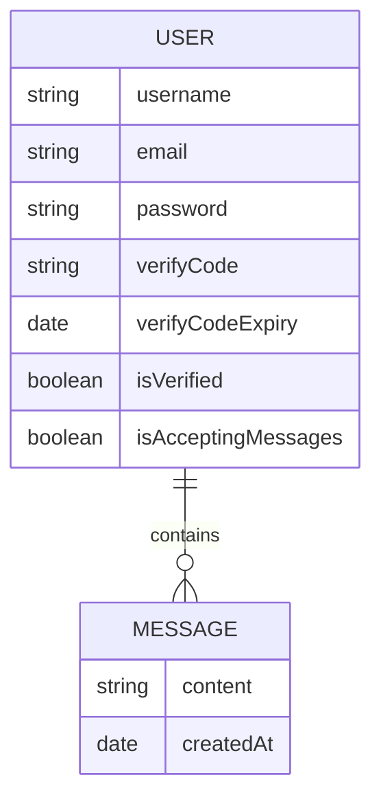

# TrueFeedback Project Report

## 1. Problem Statement
TrueFeedback is a dynamic web application that allows people to receive anonymous feedback through a public profile link. The system solves a common communication problem: users often want honest opinions, suggestions, or feedback, but other people may hesitate to share them openly. By allowing anonymous message submission, the application lowers that barrier and makes feedback easier to collect.

The system is needed because it gives each registered user a personal message board that can be shared publicly, while still giving the owner control over whether incoming messages are accepted. The application also includes account verification and authentication so that message management remains private to the account owner.

This project demonstrates core Web Engineering concepts through an actual working implementation:

- HTTP-based communication between browser clients and server endpoints
- REST-style API design using route handlers
- Client-server interaction between React pages and backend APIs
- Database integration with MongoDB
- Asynchronous programming using `async`/`await`
- MVC-like separation between UI, API logic, and data model

Important note: the implementation is built with `Next.js` and React, not AngularJS or Express.js. This report describes only the technologies and features that are actually present in the repository.

## 2. System Architecture
The application follows a client-server style architecture inside a single Next.js project:

- The frontend is built with `Next.js` App Router and React client components.
- The backend is implemented using `Next.js` API route handlers under `src/app/api`.
- Authentication is handled with `NextAuth` using a credentials provider and JWT-based sessions.
- Data is stored in `MongoDB` and accessed through `Mongoose`.
- Email verification is sent through `Resend` using a React Email template.

### Main Architecture Components
- **Frontend layer**: sign-up, sign-in, verification, dashboard, landing page, and public message page
- **Backend/API layer**: route handlers for sign-up, verification, username checking, message sending, message retrieval, toggle settings, and message deletion
- **Data layer**: `User` document with embedded `messages`
- **External service**: Resend for verification email delivery

### Architecture Diagram


### How the Layers Interact
1. A user opens a page such as `/sign-up`, `/sign-in`, `/dashboard`, or `/u/[username]`.
2. React forms submit data using `axios` to backend endpoints under `/api/...`.
3. The API route validates/processes the request and interacts with MongoDB using Mongoose.
4. The API sends JSON responses back to the frontend.
5. The frontend updates the UI and displays feedback using toast notifications.
6. Protected routes such as `/dashboard` are guarded through `middleware.ts` and session checks.

### MVC-Like Design Pattern
The project does not use a strict MVC folder structure, but it applies MVC-like separation:

- **Model**: `src/model/User.ts`
- **View**: pages and UI components under `src/app` and `src/components`
- **Controller-like logic**: route handlers under `src/app/api`

## 3. URI Design and User Flow

### Main Page Routes
| Route | Purpose |
| --- | --- |
| `/` | Landing page introducing the platform |
| `/sign-up` | User registration form |
| `/sign-in` | User login form |
| `/verify/[username]` | Account verification page for the entered code |
| `/dashboard` | Authenticated user dashboard |
| `/u/[username]` | Public page where anyone can send an anonymous message |

### Main API Routes
| Route | Method | Purpose |
| --- | --- | --- |
| `/api/sign-up` | `POST` | Register user and send verification code |
| `/api/check-username-unique` | `GET` | Check whether a username is available |
| `/api/verify-code` | `POST` | Verify account with username and code |
| `/api/accept-messages` | `GET` | Read current message acceptance status |
| `/api/accept-messages` | `POST` | Update message acceptance status |
| `/api/send-message` | `POST` | Submit anonymous message to a user |
| `/api/get-messages` | `GET` | Get all messages for the authenticated user |
| `/api/delete-message/[messageid]` | `DELETE` | Delete one message |
| `/api/auth/[...nextauth]` | `GET`, `POST` | NextAuth authentication handler |

These backend endpoints are implemented as Next.js route handlers, not Express controllers.

### User Flow
```mermaid
flowchart TD
    A[Visitor opens app] --> B{Has account?}
    B -- No --> C[Go to /sign-up]
    C --> D[Check username uniqueness]
    D --> E[Submit registration]
    E --> F[Verification email sent]
    F --> G[Open /verify/username]
    G --> H[Enter 6-digit code]
    H --> I[Account verified]
    I --> J[Go to /sign-in]
    B -- Yes --> J
    J --> K[Login with username/email and password]
    K --> L[/dashboard]
    L --> M[Copy public link /u/username]
    L --> N[Toggle accepting messages]
    L --> O[View received messages]
    L --> P[Delete unwanted messages]
    Q[Public visitor opens /u/username] --> R[Enter anonymous message]
    R --> S[/api/send-message]
    S --> O
```

### Interaction Summary
- New users register and receive a verification code by email.
- Verified users sign in and are redirected to the dashboard.
- The dashboard provides a public shareable link and lets the user:
  - enable or disable message acceptance
  - refresh and view received messages
  - delete individual messages
- Public visitors use `/u/[username]` to send anonymous messages without signing in.

## 4. Database Design
The application uses MongoDB with Mongoose. The main data structure is a `User` document containing an embedded array of `Message` subdocuments.

### User Schema
Defined in `src/model/User.ts`.

| Field | Type | Description |
| --- | --- | --- |
| `username` | `String` | Unique username for public identity |
| `email` | `String` | Unique user email |
| `password` | `String` | Hashed password |
| `verifyCode` | `String` | 6-digit verification code |
| `verifyCodeExpiry` | `Date` | Expiration time of the verification code |
| `isVerified` | `Boolean` | Whether the account is verified |
| `isAcceptingMessages` | `Boolean` | Whether public messages are currently allowed |
| `messages` | `Message[]` | Embedded message records received by the user |

### Message Subdocument Schema
Also defined in `src/model/User.ts`.

| Field | Type | Description |
| --- | --- | --- |
| `content` | `String` | Anonymous message text |
| `createdAt` | `Date` | Time when the message was created |

### Relationship
- One `User` contains many `Message` subdocuments.
- Messages are embedded inside the user document instead of being stored in a separate collection.

### ER-Style Diagram


## 5. REST API Endpoints
The project includes more than five API endpoints and supports practical CRUD behavior across the implemented features.

### Endpoint Details

#### 1. `POST /api/sign-up`
- Registers a new user
- Checks whether the username is already taken by a verified user
- Checks whether the email already exists
- Hashes the password using `bcryptjs`
- Generates a 6-digit verification code
- Stores the user in MongoDB
- Sends a verification email through Resend

#### 2. `GET /api/check-username-unique?username=...`
- Validates the username using Zod
- Checks whether a verified user already exists with that username
- Returns whether the username can be used

#### 3. `POST /api/verify-code`
- Accepts `username` and `code`
- Finds the matching user
- Verifies that the code matches
- Verifies that the code has not expired
- Updates `isVerified` to `true` on success

#### 4. `POST /api/send-message`
- Accepts `username` and `content`
- Finds the target user
- Checks whether the target user accepts messages
- Appends a new message subdocument to the user’s `messages` array

#### 5. `GET /api/get-messages`
- Requires an authenticated session
- Retrieves the authenticated user’s messages
- Uses a MongoDB aggregation pipeline to unwind, sort, and regroup messages by newest first

#### 6. `GET /api/accept-messages`
- Requires authentication
- Returns the current `isAcceptingMessages` value for the logged-in user

#### 7. `POST /api/accept-messages`
- Requires authentication
- Updates the `isAcceptingMessages` setting for the logged-in user

#### 8. `DELETE /api/delete-message/[messageid]`
- Requires authentication
- Removes one embedded message from the logged-in user’s `messages` array using `$pull`

#### 9. `GET`/`POST /api/auth/[...nextauth]`
- Handles authentication using `NextAuth`
- Supports login flow through the credentials provider configuration

### CRUD Coverage
Although the project does not use a `PUT` endpoint, it still implements full CRUD behavior across the application:

| CRUD Operation | Implemented Behavior |
| --- | --- |
| Create | Register user, send anonymous message |
| Read | Check username, read acceptance status, fetch messages |
| Update | Verify account, update acceptance status, overwrite password/code for unverified existing email during re-registration |
| Delete | Delete a specific message |

### Error Handling Implemented in Code
The project includes explicit error handling in multiple API routes and frontend forms. Real cases present in the code include:

- Username already taken
- User already exists with the same email
- User not found
- Verification code expired
- Incorrect verification code
- Unauthenticated access to protected APIs
- User not accepting messages
- Message not found or already deleted
- Internal server/database/email sending failures

Frontend forms also handle failed API requests and display toast messages to the user.

## 6. Screenshots
This report does not include fabricated screenshots. The following screenshots should be captured from the running system and inserted later.

### Screenshot Placeholder 1: Home Page
- Route: `/`
- Capture the landing page hero section and anonymous message carousel

### Screenshot Placeholder 2: Sign-Up Page
- Route: `/sign-up`
- Capture the registration form showing username, email, and password fields

### Screenshot Placeholder 3: Verification Page
- Route: `/verify/[username]`
- Capture the page for entering the 6-digit verification code

### Screenshot Placeholder 4: Sign-In Page
- Route: `/sign-in`
- Capture the login form that accepts username/email and password

### Screenshot Placeholder 5: Public Message Page
- Route: `/u/[username]`
- Capture the anonymous message form used by public visitors

### Screenshot Placeholder 6: Dashboard
- Route: `/dashboard`
- Capture the authenticated dashboard showing:
  - unique public profile link
  - accept messages toggle
  - refresh button
  - list of received messages

## 7. Conclusion
TrueFeedback is a dynamic anonymous feedback web application that allows registered users to collect anonymous messages through a public link. The application demonstrates important web engineering principles through a real implementation that combines a modern frontend, backend APIs, authentication, database integration, asynchronous communication, and structured data handling.

The system provides clear benefits:

- It makes anonymous feedback collection simple and accessible.
- It gives account owners control over whether messages are accepted.
- It protects private dashboard operations through authentication.
- It uses email verification to improve account authenticity.
- It demonstrates how a full-stack web application can be built using modern JavaScript/TypeScript technologies.

Overall, the project successfully functions as a dynamic web-based system and clearly shows practical use of HTTP communication, REST-style endpoints, client-server design, MongoDB persistence, and asynchronous web programming.

## 8. Appendix: Current Implementation Review
This section summarizes repository-backed observations from the current codebase. These are included for honesty and technical review quality.

### Implemented Strengths
- The application has a clear real-world use case and coherent user flow.
- The project includes more than five API endpoints.
- Authentication and protected routing are implemented.
- Database integration is present and functional at the schema/API level.
- Validation is present through Zod schemas.
- Error handling is implemented in both backend responses and frontend toasts.

### Observed Issues and Gaps
- `src/app/api/suggest-messages/route.ts` exists but is effectively empty, so it should not be presented as a working feature.
- `npm run lint` currently fails with React Hooks rule errors because several page components are named `page` instead of uppercase component names.
- `src/components/MessageCard.tsx` still contains placeholder UI text such as `Card Title`, `Card Description`, and `Card Action`.
- The delete confirmation dialog inside `MessageCard.tsx` says it will delete the account and remove data from servers, but the actual action only deletes a message.
- `README.md` is still the default Next.js boilerplate and does not describe the project.
- Metadata in `src/app/layout.tsx` and `src/app/(app)/layout.tsx` still uses generic `Create Next App` text.

### Verification Checklist Used for This Report
- Technologies were checked against `package.json` and source usage.
- Routes were checked against `src/app` and `src/app/api`.
- Data fields were checked against `src/model/User.ts`.
- Authentication flow was checked against NextAuth options, middleware, and auth pages.
- The report intentionally avoids false claims about AngularJS, Express.js, relational tables, or a finished AI message suggestion feature.
